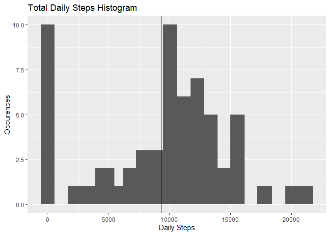
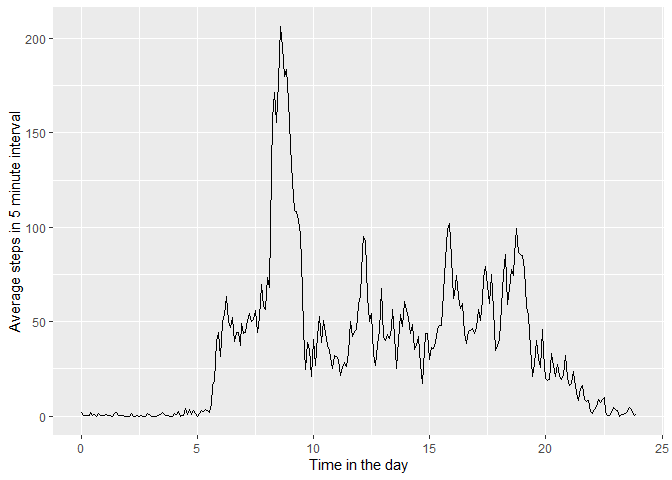
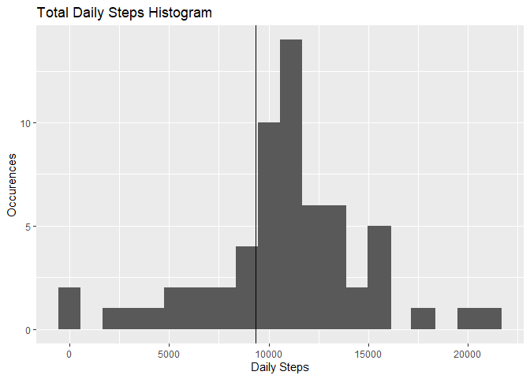
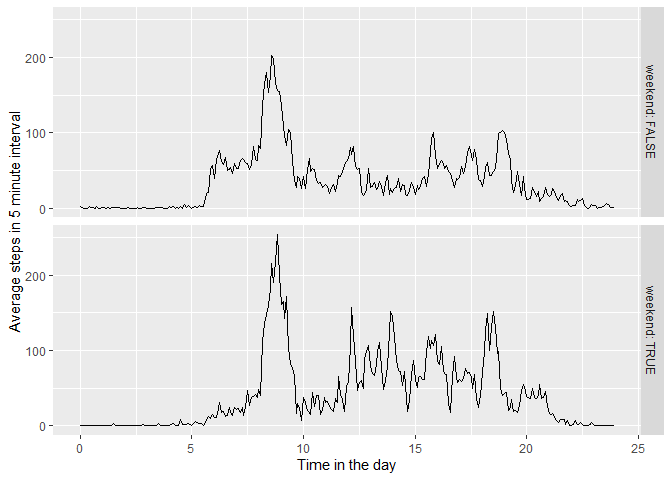

## Loading and preprocessing the data
First the required packages for the analysis and presentation are loaded.

```r
library(ggplot2)
library(dplyr)
library(lubridate)
```

The data from the included activity.csv file is read into R. Some preprocessing is also included. The number of steps in a day is forced into a numeric format and the date and interval variables are combined into a date_time lubridate variable. 

```r
activity<-read.csv("activity.csv") %>%
  mutate(steps=as.numeric(steps)) %>%
  mutate(date_time=ymd_hm(paste(date, floor(interval/100), 
                                interval-floor(interval/100)*100, sep="-"))) %>%
  select(steps, date_time)
```

## What is mean total number of steps taken per day?
Data is grouped by the date on which is was collected, combining all the information for each day. The total number of steps on each day is then calculated. The "by_date" dataframe therefore contains every day on which data was recorded and the total number of steps taken on that day.

```r
by_date<-activity %>%
  group_by(date(date_time)) %>%
  summarise(total_steps = sum(steps, na.rm = TRUE))
```

Plotting a histogram of the total number of steps taken on each day. The mean number of steps per day is show by the black vertical line.

```r
qplot(data=by_date, x=total_steps) + geom_histogram(bins=20) + 
  xlab("Daily Steps") + ylab("Occurences") + ggtitle("Total Daily Steps Histogram") +
  geom_vline(xintercept =  mean(by_date$total_steps,na.rm = TRUE))
```

<!-- -->

The mean and median number of steps per day was then calculated:

```r
mean(by_date$total_steps,na.rm = TRUE)
```

```
## [1] 9354.23
```

```r
median(by_date$total_steps,na.rm = TRUE)
```

```
## [1] 10395
```

## What is the average daily activity pattern?
The hour and minute when each 5 minute interval begins was extracted from the date_time variable. The data was then grouped by this new "time" variable, grouping data by the time on the day which it was collected. The mean value for every one of these intervals was then taken. The "by_time" dataframe is therefore the beginning of each 5 minute interval and the mean number of steps taken in that interval.


```r
by_time<-activity %>%
  mutate(time=hm(paste(hour(activity$date_time), minute(activity$date_time),
                    sep=":"))) %>%
  group_by(time) %>%
  summarise(mean_steps = mean(steps, na.rm = TRUE))
```

The interval(s) during which the most average steps occured was then found:

```r
pull(by_time[which(by_time$mean_steps==max(by_time$mean_steps)),"time"])
```

```
## [1] "8H 35M 0S"
```

A plot of the average number of steps take every 5 minutes during the day was then plotted:

```r
ggplot(data=by_time, aes(x=as.numeric(time)/3600, y=mean_steps, group=1)) + 
  geom_line() + xlab("Time in the day") + ylab("Average steps in 5 minute interval")
```

<!-- -->

## Imputing missing values
First a copy of the activity dataframe was created including the same "time" variable discussed in the previous section. An additional column was created "isna" which records whether the "steps" variable is missing for that time interval.


```r
filled_activity <- mutate(activity, 
                          time=hm(paste(hour(activity$date_time), 
                                        minute(activity$date_time))))
filled_activity<-left_join(filled_activity, by_time) %>%
  mutate(isna = as.numeric(is.na(steps)))
```

```
## Joining, by = "time"
```

This variable was used to calculate the number of missing "steps" values in the dataset:

```r
sum(filled_activity$isna)
```

```
## [1] 2304
```

Missing values were then replaced with the average steps taken in corresponding time intervals on dates with available data.

```r
filled_activity$steps[is.na(filled_activity$steps)]<-0
filled_activity<-mutate(filled_activity, filled_steps=steps+isna*mean_steps)
filled_activity<-select(filled_activity, date_time, filled_steps)
```

The filled_activity dataframe is a copy of the original "activity" dataframe but with missing "steps" values replaced with a corresponding mean for that day. This was then grouped by date and a histogram of the total number of daily steps plotted. The mean value is shown by the vertical black line.

```r
filled_by_date<-filled_activity %>%
  group_by(date(date_time)) %>%
  summarise(total_steps = sum(filled_steps))
```

```
## `summarise()` ungrouping output (override with `.groups` argument)
```

```r
qplot(data=filled_by_date, x=total_steps) + geom_histogram(bins=20) + 
  xlab("Daily Steps") + ylab("Occurences") + ggtitle("Total Daily Steps Histogram") +
  geom_vline(xintercept =  mean(by_date$total_steps,na.rm = TRUE))
```

```
## `stat_bin()` using `bins = 30`. Pick better value with `binwidth`.
```

<!-- -->

The mean and median values of the filled dataset were then calculated:

```r
mean(filled_by_date$total_steps,na.rm = TRUE)
```

```
## [1] 10766.19
```

```r
median(filled_by_date$total_steps,na.rm = TRUE)
```

```
## [1] 10766.19
```
As expected, replacing NAs with estimated values increases the mean number of steps taken in a day, as values taken by the sum operation as 0 are replaced with non-0 numbers. The median is also increased, but by a smaller amount. 

## Are there differences in activity patterns between weekdays and weekends?
Using the new filled dataset, an additional column was added "weekend", a logical variable denoting if the data was recorded on  a weekend or not. The data was then grouped by both this new variable and the time of day when the recording was taken.

```r
filled_by_time<-filled_activity %>%
  mutate(time=hm(paste(hour(filled_activity$date_time), minute(filled_activity$date_time),
                    sep=":"))) %>%
  mutate(weekend=wday(date_time)>5) %>%
  group_by(time, weekend) %>%
  summarise(mean_steps = mean(filled_steps, na.rm = TRUE))
```

```
## `summarise()` regrouping output by 'time' (override with `.groups` argument)
```


The average number of steps taken in each interval was plotted against the time of day for both weekdays and weekends:

```r
ggplot(data=filled_by_time, aes(x=as.numeric(time)/3600, y=mean_steps)) + 
  geom_line() + xlab("Time in the day") + ylab("Average steps in 5 minute interval") +
  facet_grid(rows=vars(weekend), labeller = label_both)
```

<!-- -->
